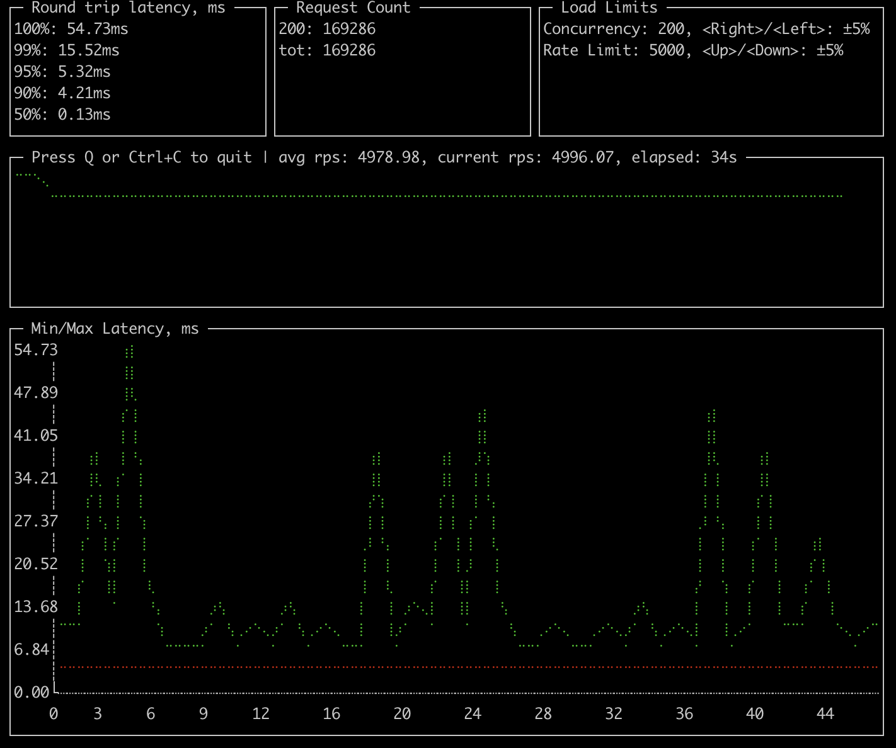

# cache-story

This is a demo application to showcase a few things about in-memory caching and explain design decisions
for [github.com/bool64/cache](https://github.com/bool64/cache).

_TL;DR_ In-memory caching is a great way to improve performance and resiliency of an application at cost of memory and delayed data consistency. You need to take care of concurrent updates, error caching, failover handling, background updates, expiration jitter and cache warmup with transfer.

## The Story

Caching is one of the most efficient techniques to improve performance, because the fastest way to get rid of a task is skipping it. Unfortunately caching is not a silver bullet, in some cases you can not afford reusing result of a task due to transactionality/consistency constraints. Cache invalidation is notoriously one of [two hard things](https://martinfowler.com/bliki/TwoHardThings.html) in Computer Science.

It is best when domain operates on immutable data and so cache invalidation is not necessary. In such case cache is usually a net benefit. However, if there are requirements to keep mutable data in sync, cache invalidation is necessary.
The simplest strategy is to invalidate cache based on time to live (TTL). Even if seems like a bad fit compared to event-based invalidation, consider simplicity and portability. Events do not guarantee timely delivery, in worst case scenarios (for example if event broker is temporary down or overloaded) events could be even less precise than TTL.

Short TTL is often a good compromise between performance and consistency. It would reduce the load under heavy traffic acting as a barrier to the data source. For the low traffic impact would be negligible.

### Demo Application

Let's start with a simple demo application. It will receive URL with query parameters and respond with a JSON object determined by those parameters. Unique results will be stored in database to make things realistically slow.

We're going to put some load on the application with a [custom](https://github.com/vearutop/cache-story/blob/master/cmd/cplt/cplt.go) [`plt`](https://github.com/vearutop/plt).

Custom `plt` has additional parameters:

* `cardinality` - number of unique URLs to be generated, this affects cache hit rate,
* `group` - number of requests with similar URL being sent at once, this imitates concurrent access to the same key.

```
go run ./cmd/cplt --cardinality 10000 --group 100 --live-ui --duration 10h --rate-limit 5000 curl --concurrency 200 -X 'GET'   'http://127.0.0.1:8008/hello?name=World&locale=ru-RU'   -H 'accept: application/json'
```

Such a command will start a client that will send 10000 different URLs in the loop, trying keep rate of 5000 requests per second by using up to 200 concurrent requests. Every URL would be sent in a batch of 100 requests to imitate concurrency on a single resource.

It will show live performance statistics and overall results.



Demo app has three modes of operation controlled by `CACHE` environment variable:

* `none` - no caching, all requests are served with involvement of the database,
* `naive` - naive caching with a simple map and TTL of 3 minutes,
* `advanced` - caching using [`github.com/bool64/cache`](https://github.com/bool64/cache) library that implements a
  number of features to improve performance and resiliency, TTL is also 3 minutes.

Application is available at [github.com/vearutop/cache-story](https://github.com/vearutop/cache-story).
If you would like to experiment yourself with it, you can start it with `make start-deps run`.
It depends on `docker-compose` to spin up database, prometheus, grafana (http://localhost:3001) and jaeger (http://localhost:16686/). You can stop dependencies with `make stop-deps` later.

On my machine I was able to achieve ~500 RPS with no cache. After ~130 concurrent requests DB starts choking with `Too many connections`. Such result is not great, not terrible, but looks like an improvement opportunity.
Let's see what we can achieve with help of caching.


With `advanced` cache same laptop was able to show these results (roughly 60x throughput with lower latency).


```
go run ./cmd/cplt --cardinality 10000 --group 100 --live-ui --duration 10h curl --concurrency 100 -X 'GET'   'http://127.0.0.1:8008/hello?name=World&locale=ru-RU'   -H 'accept: application/json'
```

```
Requests per second: 25064.03
Successful requests: 15692019
Time spent: 10m26.078s

Request latency percentiles:
99%: 28.22ms
95%: 13.87ms
90%: 9.77ms
50%: 2.29ms
```

### Bytes VS Structures

Which one is better?

That depends on the use case, byte cache (or storing data as `[]byte`) have some advantages:

* it grants immutability, because you'll need to decode a new value every time you need it,
* it generally takes less memory, because of less fragmentation,
* it is more friendly to garbage collector, because there is nothing to traverse through,
* it can be easily sent over the wire, because it is exactly what wire expects,
* allows precise memory limit, bytes are so easy to count.

Main disadvantage is the cost of encoding and decoding. In hot loops it can become prohibitively expensive.

Advantages of structures:

* no need to encode/decode a value every time you need it,
* better expressiveness as you can potentially cache things that can not be serialized,

Disadvantages of structure cache:

* mutability, because you reuse same value multiple times it is quite easy to change it without intention,
* memory usage, structures take relatively sparse areas of memory,
* garbage collector pressure, if you have a large set of long-living structures, GC may spend significant time traversing them and proving they are still in use,
* nearly impossible to impose a total memory limit on a cache instance, dynamically-sized items are stored on the heap together with everything else.

In this article we will use structure cache.

### Naive Cache

The simplest in-memory cache is a [`map` guarded by a mutex](https://github.com/vearutop/cache-story/blob/master/internal/infra/cached/naive.go).
When you need a value for a key, you first check if it's in the cache and not expired.
If it's not, you build it from the data source and put it in the cache.
Then you return the value to the caller.

This logic is simple, but it has some drawbacks that may lead to critical issues.

### Concurrent Updates

When multiple callers simultaneously miss the same key, they will all try to build the value. This can lead to a deadlock or to resource exhaustion with [cache stampede](https://en.wikipedia.org/wiki/Cache_stampede) failure.

Additionally, there will be extra latency for all the callers that would try to build the value.
If some of those builds fail, parent callers will fail even though there might be a valid value in the cache.


The issue can be simulated by using low cardinality with high grouping, so that many similar requests are sent at once.

```
go run ./cmd/cplt --cardinality 100 --group 1000 --live-ui --duration 10h --rate-limit 5000 curl --concurrency 150 -X 'GET'   'http://127.0.0.1:8008/hello?name=World&locale=ru-RU'   -H 'accept: application/json'
```


This chart shows application started with `naive` cache and then, on the blue marker it was restarted with `advanced` cache. As you can see key locking can have a significant impact on performance (mind _Incoming Request Latency_) and resource usage (mind _DB Operation Rate_).

The solution could be to block parallel builds, so that only one build is in progress at a time. But this would suffer from contention if there are many concurrent callers asking for a variety of keys.

A better solution is to lock the builds per key, so that one of the callers acquires the lock and owns the build, while all the others wait for the value.


### Background Updates

When cached entry expires it needs a new value, building new value can be slow. If we do it synchronously, we'll slow down tail latency (99+ percentile). For cache entries that are in high demand it is feasible to start the build in advance, even before the value is expired. It can also work if we can afford some level of staleness for the expired value.

In such case we can immediately serve stale/soon-to-be-expired value and start update in background. One caveat here is that if build depends on parent context, the context may be cancelled right after we served stale value (for example when parent HTTP request was fulfilled). If we use such context to access database, we'll get a `context canceled` error.
Solution for this problem is to "[detach](https://github.com/bool64/cache/blob/v0.2.5/context.go#L66-L85)" the context from the parent context and ignore parent cancellation.

Another strategy might be to proactively rebuild cached entries that are soon to be expired, without a parent request, but this may lead to resource exhaustion due to keeping obsolete cache entries that are of no interest to anybody.

### Expiration Sync

Imagine situation that we start a new instance with TTL cache enabled, cache is empty and almost every request leads to cache miss and value creation. This will spike the load on the data source and store cached entries with very close expiration time. Once TTL have passed, the majority of cached entries will expire almost simultaneously, this will lead to a new load spike. Updated values will have close expiration time again and situation will repeat.

This is a common problem for hot cache entries.

Eventually cache entries will come out of sync, but this may take a while.

Solution to this problem is to break the sync by adding jitter to the expiration time.
If expiration jitter is 10% (0.1) it means TTL will vary from `0.95 * TTL` to `1.05 * TTL`. Even such a small jitter will already help to reduce expiration synchronization.

Here is an example, we're pushing load with high cardinality and high concurrency on the service. It will require many entries to be available in short period of time, enough to form an expiration spike.

```
go run ./cmd/cplt --cardinality 10000 --group 1 --live-ui --duration 10h --rate-limit 5000 curl --concurrency 200 -X 'GET' 'http://127.0.0.1:8008/hello?name=World&locale=ru-RU' -H 'accept: application/json'
```


The chart starts with `naive` cache that does not do anything to avoid the sync, second marker indicates service restart with `advanced` cache that has 10% jitter added to the expiration time. Spikes are wider and shorter and fall faster, overall service stability is better.

### Errors Caching

When value build fails the easiest thing to do is just return that error to the caller and forget about it.
This can lead to severe issues.

For example, your service works well and handles 10K RPS with help of cache, but suddenly cache builds start to fail (be it because of temporary database overload, network issue or maybe even logical error like failing validation).
At this point all 10K RPS (instead of usual 100 RPS) will hit data source directly because there will be no cache to serve.

Minor temporary outage would escalate exponentially.

For high load systems it is very important to cache failures with short TTL to avoid cascading failures.

### Failover Mode

Sometimes serving obsolete value is better than returning error. Especially if obsolete value expired recently and there is still high chance that it is equal to an up-to-date value.

Failover mode helps to improve resiliency at cost of accuracy, which is often a fair tradeoff in distributed systems.

### Cache Transfer

Cache works best when it has relevant data.
When a new instance of application is started, cache is empty.
Populating helpful data takes time, during this time cache efficiency may degrade significantly.

There are a few ways to work around the issue of "cold" cache.

You can warm up the cache by iterating over the data that is assumed to be useful.
For example, you can fetch recent contents of a database table and store them in cache.
This approach is complex and not always effective.
You need to decide what data to use and rebuild cache entries with a piece of bespoke code.
This may put excessive load on the database (or other sources of data).

You can also avoid this issue by using a shared instance of cache, like redis or memcached.
It has another issue, reading data over the network is much slower, than from local memory.
Also, network bandwidth may become a scalability bottleneck.
Wired data needs to be deserialized which adds on latency and resource usage.

The simple solution to this problem is to transfer cache from active instance to the newly started.
Cached data of active instance naturally has high relevance, because it was populated in response to actual user requests.
Transferring cache does not need to rebuild data and so it won't abuse data sources.

Usually production systems have multiple instances of application running in parallel.
During deployment, these instances are restarted sequentially, so there is always an instance that is active and has high quality cache.

Go has a built-in binary serialization format `encoding/gob`. It helps to transfer data over the wire with minimal effort. The limitation is that it is based on reflection and needs data to have exported fields.

Another caveat with cache transfer is that different versions of application may have different data structures that are not necessarily compatible. To mitigate this issue, you can fingerprint cached structures (using reflection) and abort transfer in case of discrepancy.

<details>
<summary>Here is [a sample implementation](https://github.com/bool64/cache/blob/v0.2.5/gob.go#L49-L90).</summary>

```go
// RecursiveTypeHash hashes type of value recursively to ensure structural match.
func recursiveTypeHash(t reflect.Type, h hash.Hash64, met map[reflect.Type]bool) {
	for {
		if t.Kind() != reflect.Ptr {
			break
		}

		t = t.Elem()
	}

	if met[t] {
		return
	}

	met[t] = true

	switch t.Kind() {
	case reflect.Struct:
		for i := 0; i < t.NumField(); i++ {
			f := t.Field(i)

			// Skip unexported field.
			if f.Name != "" && (f.Name[0:1] == strings.ToLower(f.Name[0:1])) {
				continue
			}

			if !f.Anonymous {
				_, _ = h.Write([]byte(f.Name))
			}

			recursiveTypeHash(f.Type, h, met)
		}

	case reflect.Slice, reflect.Array:
		recursiveTypeHash(t.Elem(), h, met)
	case reflect.Map:
		recursiveTypeHash(t.Key(), h, met)
		recursiveTypeHash(t.Elem(), h, met)
	default:
		_, _ = h.Write([]byte(t.String()))
	}
}
```

</details>

Transfer can be done with HTTP or any other suitable protocol. In this example, we will use HTTP, served at [`/debug/transfer-cache`](https://pkg.go.dev/github.com/bool64/cache#HTTPTransfer.Export). Please be aware that cache may contain sensitive information and should not have exposure to public.

For sake of this example, we can perform transfer with help of a separate instance of an application serving on a different port.

```
CACHE_TRANSFER_URL=http://127.0.0.1:8008/debug/transfer-cache HTTP_LISTEN_ADDR=127.0.0.1:8009 go run main.go
```

```
2022-05-09T02:33:42.871+0200    INFO    cache/http.go:282       cache restored  {"processed": 10000, "elapsed": "12.963942ms", "speed": "39.564084 MB/s", "bytes": 537846}
2022-05-09T02:33:42.874+0200    INFO    brick/http.go:66        starting server, Swagger UI at http://127.0.0.1:8009/docs
2022-05-09T02:34:01.162+0200    INFO    cache/http.go:175       cache dump finished     {"processed": 10000, "elapsed": "12.654621ms", "bytes": 537846, "speed": "40.530944 MB/s", "name": "greetings", "trace.id": "31aeeb8e9e622b3cd3e1aa29fa3334af", "transaction.id": "a0e8d90542325ab4"}
```


This chart shows application restarts at blue markers, last two are made with cache transfer. You can see that performance remains unaffected, while when there is no cache transfer there is a significant warmup penalty.

A less obvious benefit is that cache can also be transferred to a local instance on developer machine, this can help to reproduce and debug production issues much easier.

### Lock Contention And Low-level Performance

Essentially every cache implementation acts as a map of values by keys with concurrent (mostly read) access.

Low-level performance concerns can be considered irrelevant in many cases. For example, if you use in-memory cache to power your HTTP API, even the simplest solution with map and mutex will likely be sufficient. That is because IO operations that are performed to serve HTTP are way slower than memory operations (even with synchronization penalties). This is important to keep in mind to avoid premature optimizations and unjustified complexity.

If the application that relies on in-memory cache is mostly CPU-bound, lock contention may become significant in overall performance.

Problem with lock contention is that concurrent reads and writes have to be synchronized in order to avoid data conflicts. In case of single mutex such synchronization would impose a limitation of only one operation at a time. This means modern CPUs with multiple cores would not be able to use all the capacity.

For mostly-read workloads standard [`sync.Map`](https://pkg.go.dev/sync#Map) offers great performance, however, it degrades with more writes. There is a another custom implementation that outperforms `sync.Map` thanks to [Cache-Line Hash Table](https://github.com/LPD-EPFL/CLHT) (CLHT) data structure: [`github.com/puzpuzpuz/xsync.Map`](https://pkg.go.dev/github.com/puzpuzpuz/xsync#Map).

Another popular approach to reduce lock contention is map sharding ([fastcache](https://github.com/VictoriaMetrics/fastcache/blob/v1.10.0/fastcache.go#L112), [bigcache](https://github.com/allegro/bigcache/blob/v3.0.2/bigcache.go#L16), [bool64/cache](https://github.com/bool64/cache/blob/v0.2.5/sharded_map.go#L35)), when values are deterministically distributed in separate buckets based on keys. It has a good balance of simplicity and performance.

### Memory Management

Memory is a limited resource, so cache should not grow indefinitely.

Expired items should eventually be removed from the cache. 
This can be done synchronously or in background. Background janitor is a good idea, because it will not block the application. 
Also, background janitor can be configured to remove items with a delay, so that expired value is still available as a failover backup.

Removing expired items might be not enough to keep memory usage under control.
There are [different strategies](https://en.wikipedia.org/wiki/Cache_replacement_policies) to decide which items to evict.
When deciding on a strategy you should find a balance between CPU/memory usage and hit/miss ratio. Ultimately, goal of eviction is to optimize hit/miss ratio while remaining in acceptable performance budget, so this is the metric you need to look at when evaluating eviction strategies.

Here are some popular criteria to pick an item:
 * least-frequently used (LFU), relatively expensive as it needs to maintain counters that should be updated on every access,
 * least-recently used (LRU), relatively expensive as it needs to update item timestamps or reorder the list of keys on every access,
 * first in first out (FIFO), relatively cheap as it can use values that are populated once item cache is created,
 * random item, most performant, does not need any kinds of sorting, the least accurate.

I would suggest to evaluate FIFO and random eviction first, and only invest in LRU/LFU if it has proven significant impact on hit/miss ratio.

Now that you have a good idea about how to pick an eviction strategy, next question is "when and how many items should be evicted?".

This is a trivial question for `[]byte` cache, most of the implementations provide you precise control over how much memory to use.

The question is tricky for structure cache. There is no feasible and reliable way to determine impact of a particular structure on the heap memory usage during application execution, this information may be available to GC, but not to the application itself.

Two less precise, but still useful, metrics are:
 * total count of items in the cache,
 * total memory usage of the whole application.

Both metrics can be easily obtained during application execution, and then lead to eviction.
Because these metrics are not linearly proportional to cache memory usage, they can not be used to calculate the exact list of items to evict.
An appropriate response would be to evict a configurable fraction of the items (for example 10% of the items), once eviction is triggered.

Heap impact of cached data largely depends on mapping implementation. 
As you can see from the benchmark below, `map[string]struct{...}` may have 4x memory consumption compared to efficient binary serialization (uncompressed).

### Baseline Benchmark

Here is a baseline benchmark for storing 1M small structures (`struct { int, bool, string }`) and accessing them with 10% and 0.1% writes.
Byte caches are instrumented with binary de/encoder of structure.

```
goos: darwin
goarch: amd64
cpu: Intel(R) Core(TM) i7-9750H CPU @ 2.60GHz
```

```
name             MB/inuse   time/op (10%) time/op (0.1%)      
sync.Map         192 ± 0%   142ns ± 4%    29.8ns ±10%   // Great for read-heavy workloads.
shardedMap       196 ± 0%   53.3ns ± 3%   28.4ns ±11%   
mutexMap         182 ± 0%   226ns ± 3%    207ns ± 1%    
rwMutexMap       182 ± 0%   233ns ± 2%    67.8ns ± 2%   // RWMutex perf degrades with more writes.
shardedMapOf     181 ± 0%   50.3ns ± 3%   27.3ns ±13%   
ristretto        346 ± 0%   167ns ± 8%    54.1ns ± 4%   // Failed to keep full working set, ~7-15% of the items are evicted.
xsync.Map        380 ± 0%   31.4ns ± 9%   22.0ns ±14%   // Fastest, but a bit hungry for memory.
patrickmn        184 ± 0%   373ns ± 1%    72.6ns ± 5%   
bigcache         340 ± 0%   75.8ns ± 8%   72.9ns ± 3%   // Byte cache.
freecache        333 ± 0%   98.1ns ± 0%   77.8ns ± 2%   // Byte cache.
fastcache       44.9 ± 0%   60.6ns ± 8%   64.1ns ± 5%   // A true champion for memory usage, while having decent performance.
```

If serialization is not a problem [`fastcache`](https://github.com/VictoriaMetrics/fastcache) is the best for its outstanding memory usage.

For CPU-bound applications [`xsync.Map`](https://github.com/puzpuzpuz/xsync#Map) offers the best performance.

Also, byte cache does not necessarily mean efficient memory usage, as shown by `bigcache` (ha!) and `freecache`.

### Developer Friendliness

Programs that we write do not always behave like we want them to. Complexity leads to unexpected issues, that are hard to debug.
Unfortunately, caching makes this problem even worse. That's why it is especially important to make caching developer-friendly.

Cache may become poisoned for a variety of reasons, it should be possible to clean it up quickly and safely.
For that, consider having a special control to invalidate all cached items.
Under heavy load invalidation does not necessarily mean "deletion", if all cache is deleted at once data sources will receive excessive load and may fail.
A more gentle invalidation is "expiration" of all items with background update, while serving stale data.

Cache entry can become outdated and would mislead if somebody is investigating particular data source issues. It is convenient to disable cache for a particular request, so that cache inaccuracy can be ruled out. This may be implemented with a special header and then [context instrumentation](https://pkg.go.dev/github.com/bool64/cache#SkipRead) in middleware. Please be aware that such controls should not be available for public users as they can be used as for DOS attack. 

Fine control over logs and metrics of cache operations/state is also important.

And finally, now that Go introduced type parameters (generics), it is possible to leverage type-safe APIs for cache interfaces and offset more burden on compiler.
